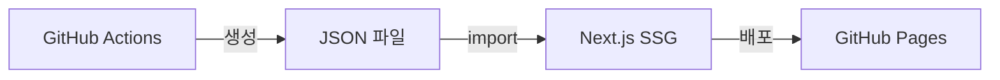
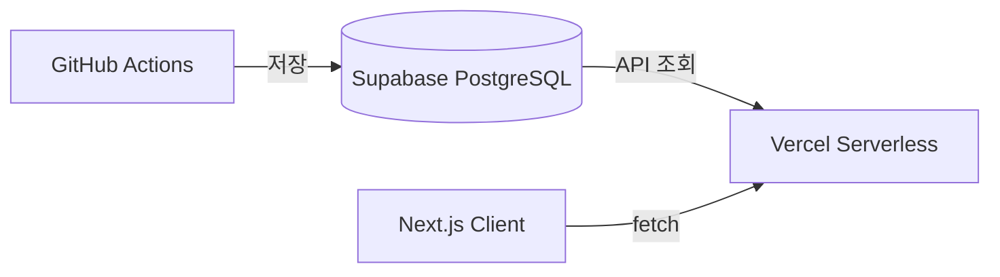

# 무료 WAS + DB 구성 계획

## 현재 구조




- 뉴스 데이터: `src/data/news.json`, `src/data/daily-news.json`
- 빌드 시점에 JSON 파일을 import하여 정적 페이지 생성
- GitHub Actions가 매일 스크립트 실행 후 빌드/배포

## 변경 후 구조




## 추천 기술 스택


| 구분  | 서비스                             | 무료 티어                     |
| --- | ------------------------------- | ------------------------- |
| DB  | **Supabase**                    | 500MB, 무제한 API 요청         |
| WAS | **Vercel Serverless Functions** | 100GB 대역폭/월               |
| 호스팅 | **Vercel**                      | 무료 (현재 GitHub Pages에서 이전) |


## 구현 단계

### 1단계: Supabase 설정 및 스키마 생성

Supabase 프로젝트 생성 후 테이블 스키마 정의:

```sql
-- daily_news 테이블
CREATE TABLE daily_news (
  id SERIAL PRIMARY KEY,
  date DATE UNIQUE NOT NULL,
  generated_at TIMESTAMPTZ NOT NULL,
  summary JSONB NOT NULL,
  articles JSONB NOT NULL
);

-- weekly_news 테이블
CREATE TABLE weekly_news (
  id SERIAL PRIMARY KEY,
  week_start DATE NOT NULL,
  week_end DATE NOT NULL,
  generated_at TIMESTAMPTZ NOT NULL,
  summary JSONB NOT NULL,
  articles JSONB NOT NULL,
  UNIQUE(week_start, week_end)
);
```

### 2단계: API Routes 생성

[src/app/api/](src/app/api/) 폴더에 Next.js Route Handlers 추가:

- `GET /api/news/daily` - 오늘의 뉴스 조회
- `GET /api/news/weekly` - 주간 뉴스 조회
- `POST /api/news/daily` - 데일리 뉴스 저장 (GitHub Actions용)
- `POST /api/news/weekly` - 주간 뉴스 저장 (GitHub Actions용)

### 3단계: Supabase 클라이언트 설정

`src/lib/supabase.ts` 생성:

```typescript
import { createClient } from '@supabase/supabase-js';

export const supabase = createClient(
  process.env.NEXT_PUBLIC_SUPABASE_URL!,
  process.env.NEXT_PUBLIC_SUPABASE_ANON_KEY!
);
```

### 4단계: 페이지 수정

[src/app/page.tsx](src/app/page.tsx)를 수정하여 JSON import 대신 API fetch 사용:

```typescript
// 변경 전
const data = await import('@/data/news.json');

// 변경 후
const res = await fetch(`${process.env.NEXT_PUBLIC_API_URL}/api/news/daily`);
const data = await res.json();
```

### 5단계: GitHub Actions 스크립트 수정

[scripts/generate-daily-news.ts](scripts/generate-daily-news.ts), [scripts/generate-news.ts](scripts/generate-news.ts) 수정:

- JSON 파일 저장 대신 API POST 요청으로 DB에 저장

### 6단계: Vercel 배포 설정

- GitHub 연동 후 자동 배포 설정
- 환경 변수 설정:
  - `NEXT_PUBLIC_SUPABASE_URL`
  - `NEXT_PUBLIC_SUPABASE_ANON_KEY`
  - `SUPABASE_SERVICE_ROLE_KEY` (서버 사이드용)
  - `OPENAI_API_KEY`

### 7단계: GitHub Actions 워크플로우 수정

[.github/workflows/weekly-news.yml](.github/workflows/weekly-news.yml) 수정:

- GitHub Pages 배포 단계 제거
- API 호출로 데이터 저장하도록 변경

## 필요한 패키지

```bash
npm install @supabase/supabase-js
```

## 환경 변수

```env
NEXT_PUBLIC_SUPABASE_URL=https://xxx.supabase.co
NEXT_PUBLIC_SUPABASE_ANON_KEY=eyJ...
SUPABASE_SERVICE_ROLE_KEY=eyJ...
OPENAI_API_KEY=sk-...
```

